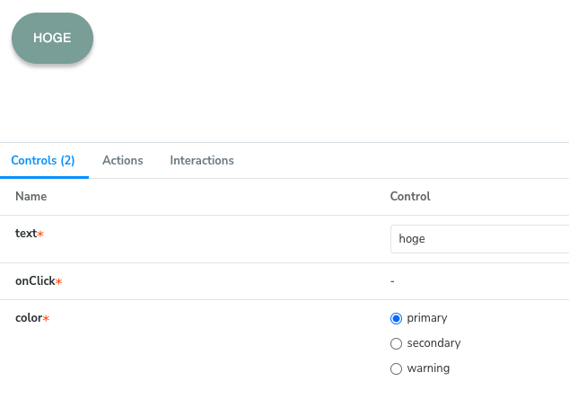
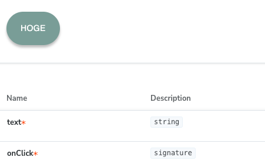

# 検討事項
悩んだ点を記録しておくファイル

avatarにonclickを持たせるべきなのか？

avatarが絶対にonClickを持っているとは限らない。そのため、avatarにonClickを持たせるのは適切ではない...？

代わりにavatarをboxでラップしてonClickをオプショナルにした方が良い...?  

buttonのonClickをもう少し見やすいしたい

現状buttonにonClickを確認しづらい

Controlsでは`onClick`だけ入力ができない

onClickのDescriptionがsignatureと表示されている。

せめてstorybook上のbuttonをクリックしたらActionsに何かしらが表示されるようにしたい。

