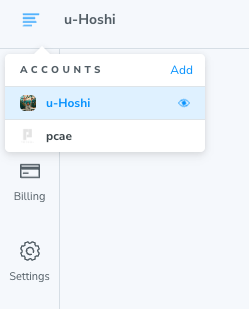
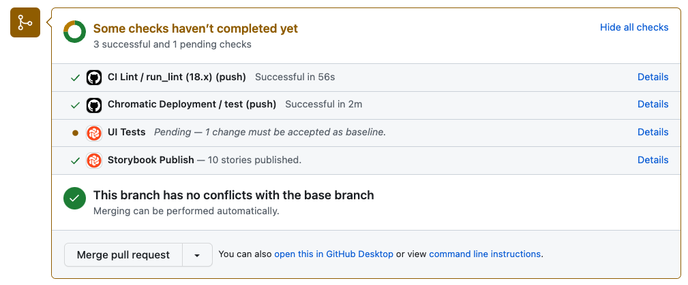
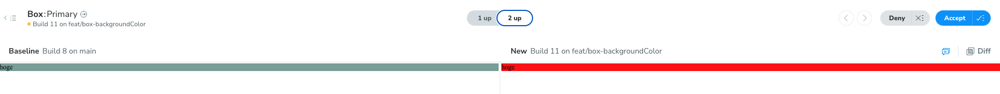
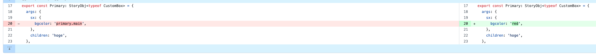

# storybookに関して

## インストール

```
$ yarn add storybook@latest init
$ yarn storybook init
```

これらでインストールした後

```
$ yarn storybook
```

で起動できる。

## muiのthemeをstorybookで適用させる

```ts:.storybook/preview.tsx
export const decorators = [
  withThemeFromJSXProvider({
    themes: {
      light: theme, // 一旦は lightにthemeを設定
    },
    defaultTheme: 'light',
    Provider: ThemeProvider,
  }),
];
```

## Chromaticにデプロイ

[Chromatic](https://www.chromatic.com/?utm_source=storybook_website&utm_medium=link&utm_campaign=storybook)にアクセスして、GitHubアカウントでサインアップ

組織を選択してプロジェクトを選択



パッケージをインストール

```
$ yarn add --dev chromatic
$ npx chromatic --project-token=CHROMATIC_PROJECT_TOKEN
```

デプロイする際に、`⚠ No 'chromatic' script found in your package.json
Would you like me to add it for you? [y/N]`は「y」と答えると、scripts に chromatic が追加されて、さっきのcommandが登録される

https://www.chromatic.com/setup?appId=64a8009ea6fee9b63fbd6a01 に登録する

このままcommitするとChromaticのトークンが漏れるので、環境変数に登録する

```
"chromatic": "npx chromatic --project-token=$CHROMATIC_PROJECT_TOKEN"
```

https://www.chromatic.com/build?appId=64a8009ea6fee9b63fbd6a01

## UIテスト

storybookを使ってuiの変更テストを行うためにはGithubActionsを使ってCIでデプロイを走らせる必要があるのでworkflowsに設定を追加する

[.github/workflows/chromatic.yaml](https://github.com/u-Hoshi/ui-library-1/blob/main/.github/workflows/chromatic.yaml)を参照

デプロイが走るようになったら実際にブランチを切って開発をしてプルリクを出す。

プルリクを出してしばらくすると、`UI Tests`のチャックが始まるので、これが終わるまで待つ。

UiTestsのDetailを見ると、どのような変更があったかがわかる。



差分を確認して`accept`を押すと、差分がなくなりマージできるようになる。

右側の`diff`をオンにすると変更された箇所がマークされる。



コードの差分↓


## AutoDocsについて

デフォルトではAutoDocsはオフになっているので、オンにするためには2つの方法がある。[公式ドキュメント](https://storybook.js.org/blog/storybook-7-docs/#:~:text=Autodocs%20is%20now%20opt%2Din)

1. docsを追加したいstoriesのmetaに追加する

```tsx
const meta: Meta<typeof CustomBox> = {
  // 省略
  tags: ['autodocs'], // 追記
};
```

2. `main.js`に以下を追加する。
   これは全てのstoriesに適用される。

```js:.storybook/main.js
const config: StorybookConfig = {
  // 省略
  docs: {
    autodocs: true,
  },
};

```

## argTypesについて

[公式ドキュメント](https://storybook.js.org/docs/react/api/arg-types)

Type:

```ts
{
  [key: string]: {
    control?: ControlType | { type: ControlType; /* See below for more */ };
    description?: string;
    if?: Conditional;
    mapping?: { [key: string]: { [option: string]: any } };
    name?: string;
    options?: string[];
    table?: {
      category?: string;
      defaultValue?: { summary: string; detail?: string };
      subcategory?: string;
      type?: { summary?: string; detail?: string };
    },
    type?: SBType | SBScalarType['name'];
  }
}
```
